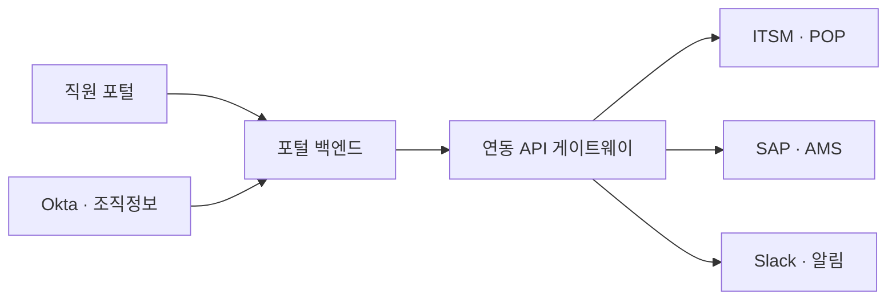

# Workplace Portal 사내 연동 인수인계 가이드

> 이 문서는 현재 POC를 실제 사내 시스템과 연결할 때 비개발자 담당자와 개발팀이 같은 그림으로 대화할 수 있도록 만든 초안입니다. 현재 화면은 Okta, ITSM, POP, SAP, AMS, Slack과 실제로 연결되어 있지 않습니다.

## 1. 권장 연결 구조

- 브라우저가 SAP, AMS, ITSM 같은 내부 시스템을 직접 호출하지 않게 합니다.
- 포털 백엔드는 화면용 데이터와 권한을 관리하고, 연동 게이트웨이는 각 시스템의 서로 다른 용어와 형식을 포털의 표준 형식으로 변환합니다.
- 내부 시스템이 교체되어도 화면과 신청 폼을 다시 만들지 않도록 `카테고리 코드`, `업무 항목 코드`, `요청 규격 버전`을 고정합니다.
- 현재 표준 요청 규격은 `lib/integration-contract.ts`, API 초안은 `docs/openapi.workplace.yaml`에 있습니다.

## 2. 시스템별 책임 기준

| 시스템 | 맡길 정보 | 원본 시스템(Source of truth) | 포털에서 하는 일 |
|---|---|---|---|
| Okta | 로그인, 사용자 ID, 그룹·권한 | Okta | 로그인 세션과 역할 확인 |
| 인사·조직 시스템 | 재직 여부, 부서, 직책, 비용센터 | 인사·조직 시스템 | 신청자·승인선 자동 완성 |
| ITSM | 티켓, 상태, 담당자, SLA, 작업 이력 | ITSM | 요청 생성·상태 조회·댓글 표시 |
| POP | 구매 요청, 예산·승인 결과 | POP | OA·비표준 물품 구매 분기 |
| SAP | 구매·회계 처리, 자산번호 | SAP | 구매 완료 후 자산번호 연결 |
| AMS | 장비 보유·지급·반납·폐기 이력 | AMS | OA 자산 선택과 수명주기 표시 |
| 공간 마스터 | 건물·층·구역·좌석·회의실 ID, 도면 버전 | 공간관리 백엔드 | 예약 화면과 관리자 도면 표시 |
| Slack | 알림, 간단한 승인·상태 확인 | 포털/ITSM | 링크와 안전한 액션 전달 |

하나의 값을 두 시스템에서 동시에 원본으로 관리하지 않는 것이 중요합니다. 예를 들어 요청 상태의 원본을 ITSM으로 정했다면 포털은 그 상태를 복제해 보여주되 임의로 다른 상태를 만들지 않습니다.

## 3. 현재 코드에 준비된 연동 장치

- 안정적인 카테고리 코드: `FACILITIES`, `OA_IT`, `ACCESS_SECURITY`, `SUPPLIES`, `PARKING_VEHICLE`, `SPACE_WORKPLACE`
- 업무별 안정적인 항목 코드: 예) `oa-return`, `parking-visitor`, `facility-hvac`
- 규격 버전: `schemaVersion: 1.0.0`
- 중복 등록 방지 키: `idempotencyKey`
- 한 요청을 여러 시스템에서 추적하는 키: `correlationId`
- 신청 채널: `web`, `slack`, `teams`, `email`
- 정형 필드: 화면 문구가 바뀌어도 `key`로 차량번호·자산번호 등을 식별
- 외부 참조: ITSM 티켓 번호, SAP 자산번호, AMS 장비번호 등을 `externalReferences`에 저장
- 연결 상태: 아직 연동 전인 POC 요청은 `not_connected`로 명확히 표시
- 공간 계층: `buildingId → floorId → zoneId → resourceId` 순서로 식별하며, 화면에 보이는 건물명·층명은 별도 표시값으로 둡니다.
- 확장 상태: 신규 건물은 가짜 좌석을 만들지 않고 `setup` 상태로 등록한 뒤 도면과 예약 정책이 준비되면 `active`로 전환합니다.
- 예산 화면: `회계연도`, `buildingId`, `비용센터`, `예산항목`, `승인예산`, `발주·약정`, `실제집행`, `가용잔액`, `기준시각`을 별도 필드로 받습니다.

## 4. 공간·예산 연동 원칙

### 공간 예약

- 좌석과 회의실은 같은 건물·층 마스터를 사용합니다. 각 화면이 건물 목록을 따로 관리하면 이름과 운영 상태가 어긋나기 쉽습니다.
- 좌석·회의실 예약 키는 `buildingId + resourceId + 시작시각 + 종료시각` 기준으로 중복을 막습니다.
- 도면 파일 자체와 좌석 좌표·회의실 좌표·운영정책을 분리해 저장합니다. 도면을 새 버전으로 교체해도 예약 이력을 보존하기 위함입니다.
- 건물 시간대와 휴무일을 건물 마스터에 둡니다. 해외 사옥이 추가되어도 예약 시각을 한 지역 기준으로 잘못 계산하지 않게 합니다.

### 예산·비용

- 포털은 회계 원장을 새로 만들지 않습니다. 승인예산·발주·전표의 원본은 ERP·구매시스템에 두고 포털은 업무 요청과 연결해 조회합니다.
- `실제 집행`과 `발주·약정`을 분리합니다. 아직 지급되지 않았어도 이미 발주한 금액을 가용예산에서 제외해야 중복 지출을 막을 수 있습니다.
- 금액마다 통화, 부가세 포함 여부, 회계연도, 비용센터, 계정과목, 프로젝트 코드를 함께 저장합니다.
- 화면에는 원본 시스템, 마지막 동기화 시각, 실패 여부를 표시하고 관리자가 실패 건을 재처리할 수 있게 합니다.
- 1단계는 ERP의 예산·집행 정보를 읽기 전용으로 연결하고, 2단계부터 업무요청 승인 결과를 구매요청으로 전송하는 것이 안전합니다.

## 5. 권장 구축 순서

1. **로그인·조회**: Okta SSO와 조직정보를 연결하고 사용자 권한을 확인합니다.
2. **ITSM 단방향 생성**: 포털 요청을 ITSM 티켓으로 만들고 외부 티켓 번호를 저장합니다.
3. **상태 양방향 동기화**: ITSM의 담당자·상태·SLA 변경을 서명된 webhook으로 포털에 반영합니다.
4. **공간 마스터·예약**: 건물·층·도면·자원 ID를 먼저 동기화하고 좌석·회의실 중복예약 잠금을 적용합니다.
5. **예산 읽기 전용**: ERP의 승인예산·발주약정·실제집행을 건물·비용센터 기준으로 조회합니다.
6. **OA 구매·자산 수명주기**: POP 승인 → SAP 자산번호 → AMS 지급·반납 순서로 연결합니다.
7. **알림 채널**: Slack·이메일 알림을 붙이고, 승인 같은 쓰기 작업은 권한과 재인증을 확인한 뒤 엽니다.

각 단계는 운영 로그와 실패 복구가 확인된 뒤 다음 단계로 넘어가는 것이 안전합니다.

## 6. 안정성과 보안 필수 조건

- Okta는 Authorization Code + PKCE 기반 OIDC를 사용하고, 브라우저에 내부 시스템 비밀키를 저장하지 않습니다.
- 모든 요청은 사용자 역할과 대상 객체 권한을 서버에서 다시 확인합니다. 특히 외부 협력사는 허용된 사업장·요청만 조회하도록 제한합니다.
- 중복 생성이 위험한 구매·자산 요청에는 `Idempotency-Key`를 필수로 사용합니다.
- 모든 시스템 로그에 동일한 `X-Correlation-Id`를 남겨 한 건의 요청을 끝까지 추적합니다.
- 외부 시스템 장애 시 즉시 무한 재시도하지 않고 지수 백오프, 최대 횟수, 실패 큐(DLQ)를 둡니다.
- 티켓 생성과 이벤트 발행 사이 유실을 막기 위해 transactional outbox 또는 동등한 보장 방식을 사용합니다.
- webhook은 서명, 타임스탬프, 재전송 방지 키를 검증합니다.
- 개인정보·방문자·차량번호·출입정보는 최소 수집, 마스킹, 보존기간, 열람 로그를 적용합니다.
- API 키와 인증서는 비밀 저장소에서 관리하고 코드·브라우저·문서에 넣지 않습니다.
- 운영자 수동 재처리 화면에는 누가 언제 무엇을 재처리했는지 감사 로그를 남깁니다.

## 7. 사내 IT팀에 요청할 자료

아래 목록을 시스템별 담당자에게 그대로 전달하면 됩니다.

- API 문서(Swagger/OpenAPI)와 테스트 URL
- 테스트 계정 또는 서비스 계정 발급 절차
- 인증 방식(OAuth/OIDC, mTLS, API key 등)과 토큰 유효시간
- 사내망·VPN·방화벽·허용 IP 조건
- 사용자, 조직, 티켓, 구매, 자산 각각의 고유 식별자
- 필수 필드, 상태 코드, 오류 코드, 호출 제한(rate limit)
- 상태 변경 webhook 지원 여부와 재전송 정책
- 건물·층·좌석·회의실의 영구 ID와 도면 파일·좌표 제공 방식
- 회계연도·비용센터·계정과목·프로젝트 코드, 예산·발주·전표 조회 API
- ERP 금액의 통화·부가세·취소전표 처리 규칙과 동기화 기준시각
- 개발·검증·운영 환경 구분과 배포 승인 절차
- 개인정보 분류, 보존기간, 삭제·마스킹 기준
- 장애 시 담당 조직, 지원 시간, 목표 복구시간

## 8. 실제 운영 전 완료 기준

- 같은 신청을 재전송해도 내부 티켓이나 구매 요청이 중복 생성되지 않습니다.
- ITSM 상태 변경이 포털에 정해진 시간 안에 반영되고, 실패 건은 운영자가 확인·재처리할 수 있습니다.
- OA 구매는 승인 결과와 SAP 자산번호, AMS 지급 대상이 한 요청에 연결됩니다.
- 퇴사자·부서 이동·협력사 권한 변경이 다음 로그인 또는 정해진 동기화 시간 안에 반영됩니다.
- iOS Safari, macOS Safari/Chrome, Windows Edge/Chrome에서 신청·첨부·조회 핵심 흐름을 실제 기기로 검증합니다.
- 접근성 키보드 탐색, 화면 확대, 오류 안내, 개인정보 마스킹을 점검합니다.
- 운영 담당자가 개발자 도움 없이 실패 건, 외부 번호, 동기화 시각, 감사 이력을 확인할 수 있습니다.
- 같은 좌석·회의실·시간에 두 예약이 동시에 확정되지 않으며, 건물별 시간대가 정확히 적용됩니다.
- 예산 가용잔액이 `승인예산 - 실제집행 - 발주·약정`과 일치하고 ERP 원본 시각을 확인할 수 있습니다.

## 9. 피해야 할 구현

- 화면에서 SAP·ITSM URL을 직접 호출하는 방식
- 화면에 보이는 한국어 문구를 시스템 식별자로 사용하는 방식
- 성공 응답 전에 “등록 완료”로 표시하는 방식
- Slack 메시지 버튼만으로 고위험 승인을 끝내는 방식
- 시스템마다 신청 데이터를 별도 폼으로 다시 매핑해 중복 관리하는 방식
- 포털 안에 ERP와 별개의 회계 원장을 만들어 금액을 이중 관리하는 방식
- 건물명·층명을 예약의 식별자로 사용하거나 도면 교체 시 좌석 ID까지 새로 만드는 방식
